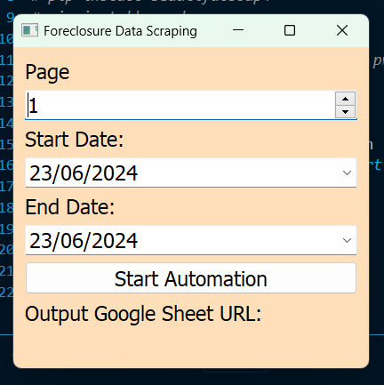
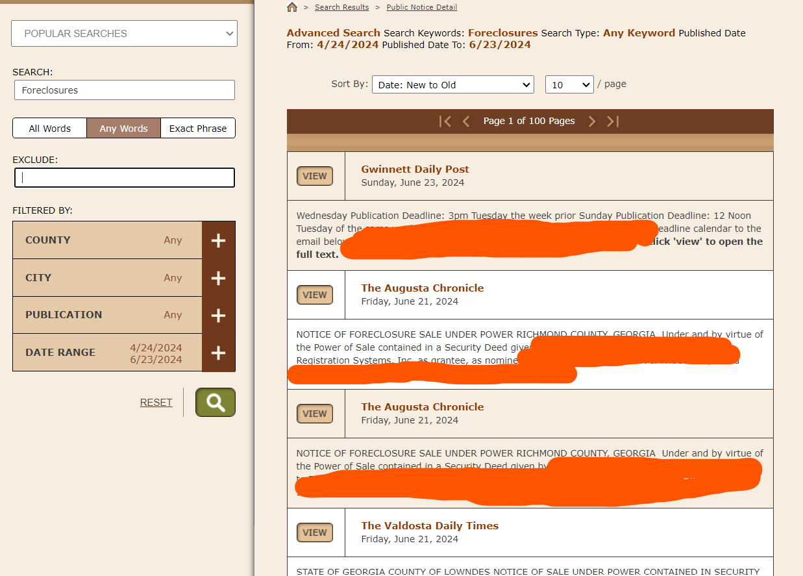
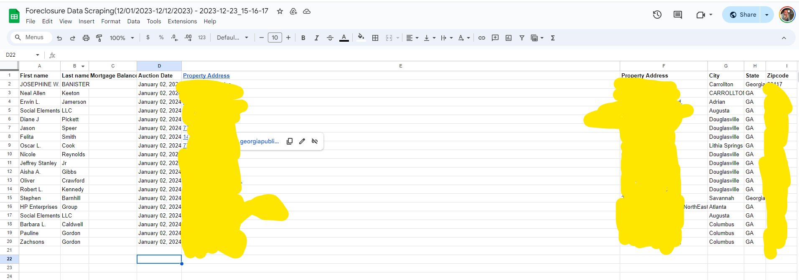

# Georgia Scraper V1

## Description
This project is about scraping a public notice site, specifically focused on Real state foreclosure data. The site has an implemented captcha that makes the scraping more challenging aside from slow loading and other dynamics.

The Developer utilized Playwright as an automation tool for scraping the site, and provided extensive Captcha solver (Playwright Recaptcha V2, which uses audio processing.)

The final project was bundled into a standalone Desktop application using Pyinstaller.

## Requirements
1. To check the bundled application, you may need an access from the developer:
https://drive.google.com/file/d/1JfutG1ZsAcibO2VOHN6D3Z7a9AZc1WbO/view?usp=sharing

2. Config file needed 
 ```
    main/config.py
 ```
- Inside this config file is the **SHEET_KEY**


3. Also note the dependencies needed, already at the **requirements.txt**:
Main dependencies
* Playwright
* Gspread
* Playwright Recaptcha
* Pandas
* Python-google-api-client

## Modules and Packages
Highlighting all modules and packages that are inside the main directory:
1. Geo_package
 ```
    geo_scraper_regex.py
 ```
This consists of two classes: **Geoscraper()** and **ForeclosureDataUI()** 
**Geoscraper** has all the playwright commands
**ForeclosureDataUI** has all the PyQt5 UI functions. (We're using PyQt5 as   Desktop application UI, this is similar to Tkinter.)

```
    test_gsheets.py
```
- this is a tester for the gspread functionality. For now it only has a fucntion for setting hyperlink to a specific column. It can be use for testing.


## Installation for Executable (Available for Windows only)
For non-developers, you can try to use the generated executable for this app, but may need access to drive.

Steps:
1. Download the executable here:
https://drive.google.com/file/d/1JfutG1ZsAcibO2VOHN6D3Z7a9AZc1WbO/view?usp=sharing

2. Open the executable, if Windows prompts a message that the file might be harmful, just Click "Run Anyway"

3. Then, you need to interact with the UI

Scraper UI

   

Foreclosures Data that are filtered

   

a. **Pages** - these are the number of pages you need to scrape in the foreclosure data.

b. **Date range** - Pick date range of all foreclosures for Start Date and End Date.

c. **Output Google Sheet URL** - this will display the output URL when the scraping process is done.


## Installation Steps (Cloning of repository)
Follow these steps to set up and run the scraper:
1. **Clone Repository:**
   - Clone this repository to your local machine.

     ```bash
     git clone https://github.com/greatdecipher/georgia_scraper.git
     ```

2. **Create Virtual Environment:**
   - Navigate to the 'main' folder and create a virtual environment.

     ```bash
     cd data_merger
     python -m venv venv
     ```

3. **Install Requirements:**
   - Install the required packages using pip.

     ```bash
     cd main/
     pip install -r requirements.txt
     ```

4. **Run the Scraper:**
   - Execute the scraper script.

     ```bash
     python -m main
     ```

## Logging
Logging is implemented on running the scraper, please see bash to trace scraper running in headless mode.

## Platform
This is a Desktop application for Windows, the developer utilizes Pyinstaller version 6 for App build.

## Project Demo
The project demo is divided into 3 parts:
### Part 1
https://www.loom.com/share/d1bccf89d33840449392e4f5173b669f?sid=9773b65a-6bad-4eaf-8adc-839fbeaf2d2a

### Part 2
https://www.loom.com/share/0a145f36baf74d309753cbd5fa67f7f3?sid=cd2ebab4-b2be-4952-9067-a1865a325ff1

### Part 3
https://www.loom.com/share/2ef126eb332f46c282277dbed2c66b13?sid=8bc231de-35f4-45fc-95f2-d6f2b3aae1fb


## Screenshots/Results
Resulting Sheet file:
https://docs.google.com/spreadsheets/d/1iGJoBdcFcIvhP3IaOhYq2E9lZEwYLEOq2lxAEHzE8q8/edit?usp=sharing




- These are the data captured from each Foreclosure notice from the Public notice page, we use **REGEX** to filter out words and strings that are necessary. A Data cleaning is being implemented in the GeoScraper class of methods.

**TABLE consists of:**
1. First name
2. Last name
3. Auction Date - kinda tricky to get because State of Georgia has its schedule foreclosures during 7th of each month.
4. Link for Public notice, with Property address as its indicator.
5. Property Address
6. City
7. State
8. Zipcode

## Notes
- Ensure that you inform the developer for any testing or additional help with the setup.

